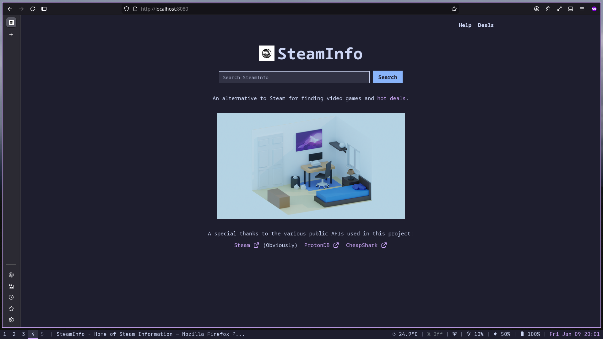
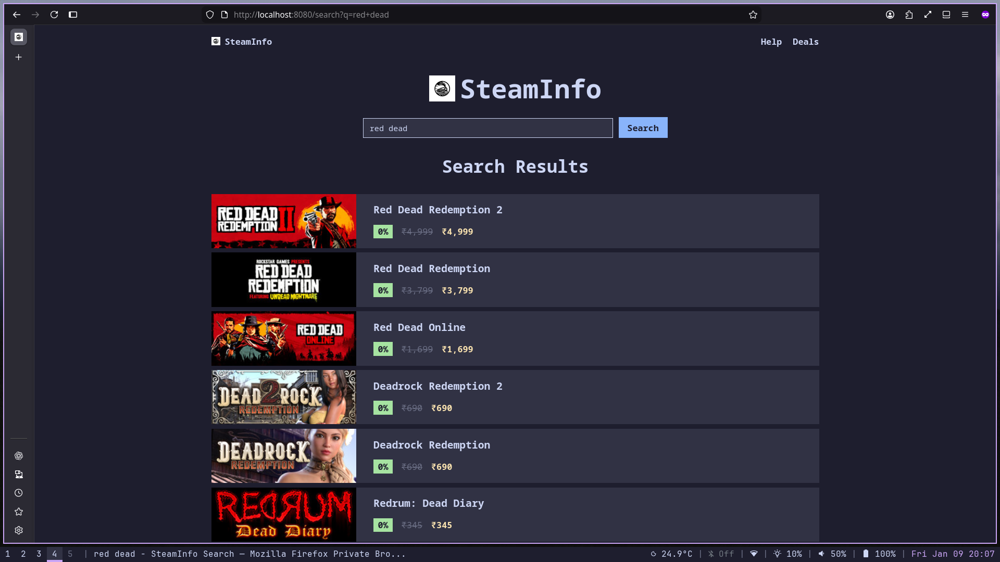
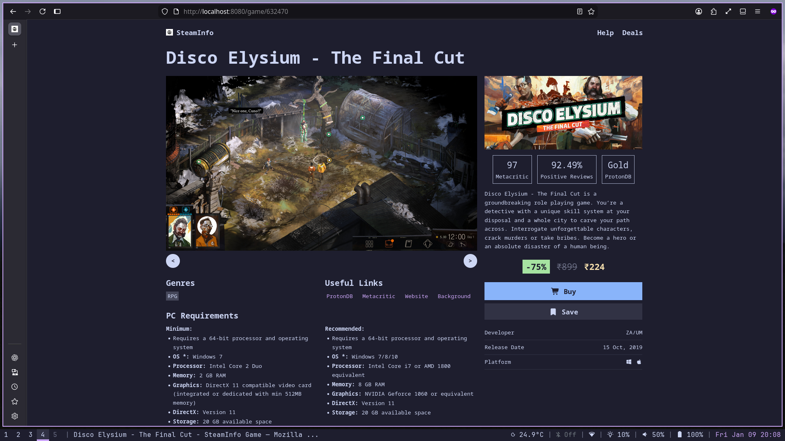
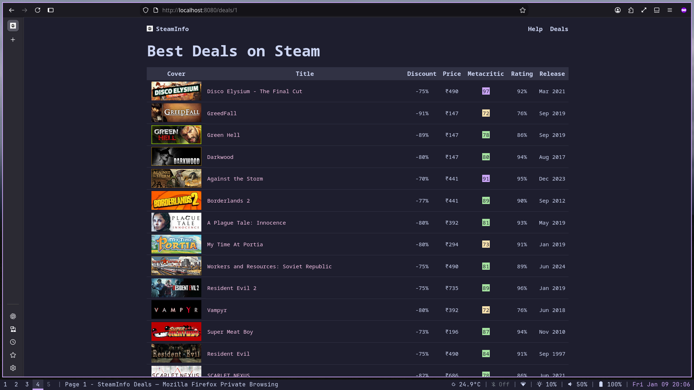

# SteamInfo

This website was created to help me explore and view Steam games library. I own a laptop notebook which is not capable of smooth rendering of the steam website. And the autoplaying video is annoying to me. Another reason was to get relevant information about a video game in a single place and not scour the internet. This helps me save time by not opening multiple tabs on my computer.

## Features

* Easily find desired video game.
* No autoplay video when viewing the video game page.
* Recent helpful reviews about the video game.
* Transparent pricing with price history chart.
* Find the best deals on Steam.

## Getting Started

1.  Clone the repository.
3.  Run the `run.sh` script.

## Screenshots

Here are some screenshots to give you a better idea of what the project looks like:

|Home|Search|
|:---------------------------------:|:-------------------------------------:|
|||

|Game Info|Steam Deals|
|:-------------------------------------------:|:----------------------------------------:|
||
